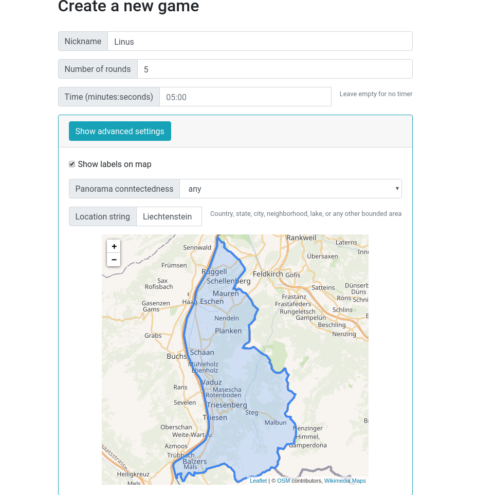
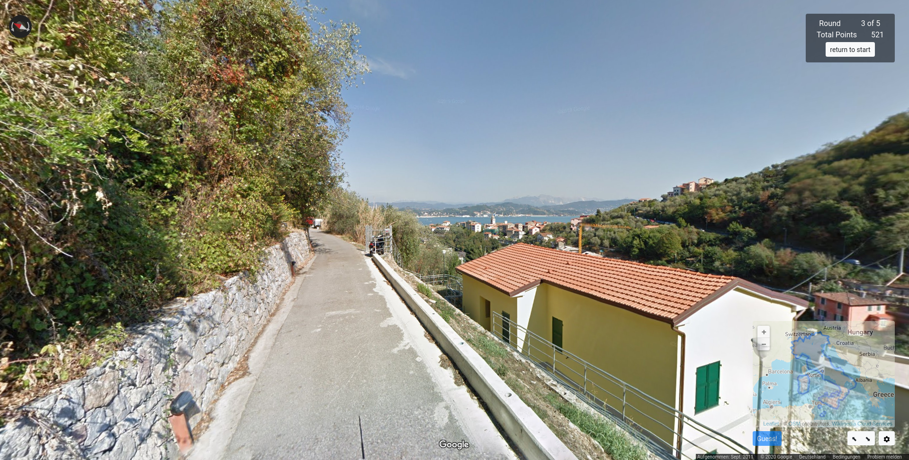
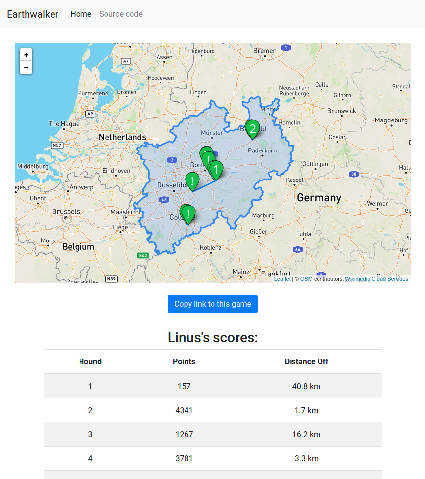

# Earthwalker

Earthwalker is a game of a similar concept to [GeoGuessr](https://geoguessr.com).
You get dropped somewhere in the world in Google Street View, and the goal is that you find out where you are,
and guess better than all of your friends. You can play against time, restrict the game to an area, and more.

It's free and open source, and the idea is that people host it themselves to play with their friends. No Google
API keys are needed, as Earthwalker "fools" the public Google Street View a bit. This is technically against Google TOS,
so I am not hosting a public version of this myself.

## How do I play it?

You need to host earthwalker or find a friend who hosts it.

## Okay, how do I host it?

### Disclaimer

First, I need to tell you that this program is technically against Google's Terms of Service, as it hides some UI elements on Street View,
and filters out information from some Google packets that are sent to Street View. Hosting this game is your own responsibility.

### Ok, I want to play the game now.

#### Setup directly

Are you set? Okay, first of all you need a server (which could also be your own computer), and some ports that are forwarded on it.
Next, you need to install [Git](https://git-scm.com/) and [Go](https://golang.org/).
Clone this repo and build the program:

    git clone https://gitlab.com/glatteis/earthwalker.git
    cd earthwalker
    go build

The executable should be called `earthwalker` or `earthwalker.exe`.
Just running it and going to `localhost:8080` in your browser should work for you.
If you are running a server, you probably configure a custom port to work with your nginx or apache config.
How to do this is described in the help: `./earthwalker(.exe) -h`.

#### Updating

You can update earthwalker by running `git pull` in its directory and then running `go build` again.

#### Docker

To use the docker container you have to run the following commands (given you already have docker installed and configured).
    
    git clone https://gitlab.com/glatteis/earthwalker.git
    cd earthwalker
    docker build -t earthwalker:local .
    docker run -p 8080:8080 earthwalker:local

It might not be necessary to use the `-t earthwalker:local` param, but it makes it a little prettier.
The website should be hosted at `localhost:8080`. The port can be remapped via docker.

#### Changing the Tile Server

If you are unhappy with the default tile server, you can change it in the configuration file (per default, this is called `config.toml`).
You need to `cp config.toml.sample config.toml` to start configuring.

#### Additional Configuration (Environment Variables)

Some configuration options can be read from environment variables; these are summarized below.  An example script setting these options is at `start.sh.sample`.

| Variable | Default | Comments |
|---|---|---|
| EARTHWALKER_PORT | 8080 |   |
| EARTHWALKER_DB_PATH_REL | executable | Sets what the location of the database directory is relative to.  Options are `executable` (relative to executable), `cwd` (relative to the current directory **at that point in the program execution**), and `absolute`. |
| EARTHWALKER_DB_PATH | /badger | Where the database directory will be, relative as specified in `EARTHWALKER_DB_PATH_REL`. |
| EARTHWALKER_STATIC_PATH | location of executable (usually `earthwalker`) | Absolute path to the directory containing `static` and `templates` |

## Images

